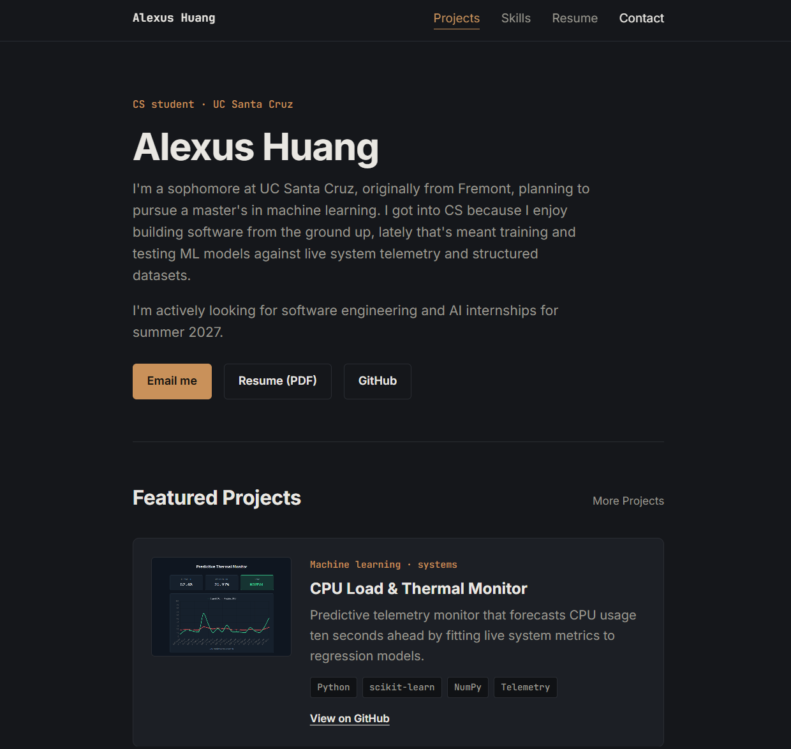

# Alexus Huang — Portfolio

🔗 **Live site:** [alexus-huang.github.io/my-portfolio](https://alexus-huang.github.io/my-portfolio/)



My personal portfolio site — built from scratch with HTML, CSS, and JavaScript to showcase my projects, skills, and background as a CS student at UC Santa Cruz.

## About

I'm a sophomore at UC Santa Cruz, originally from Fremont, planning to pursue a master's in machine learning. I enjoy building software from the ground up — lately that's meant training and testing ML models against live system telemetry and structured datasets. I'm actively looking for software engineering and AI internships for summer 2027.

## Features

- Responsive, dark-themed single-page design
- Featured projects section with tech-stack tags and GitHub links
- Dedicated projects page for a full project list
- Downloadable resume (PDF)
- Direct contact / email link

## Tech Stack

- HTML5
- CSS3
- JavaScript (vanilla)

## Project Structure

```
my-portfolio/
├── css/
│   ├── projects.css
│   └── style.css
├── images/
│   ├── edu-warning.png
│   ├── slugstudy.png
│   ├── thermal.png
│   └── workout.png
├── js/
│   └── script.js
├── screenshots/
│   └── homepage.png
├── index.html
├── projects.html
├── resume.pdf
└── README.md
```

## Getting Started

To run locally:

```bash
git clone https://github.com/alexus-huang/my-portfolio.git
cd my-portfolio
```

Then open `index.html` in your browser, or serve it locally:

```bash
npx serve .
```

## Deployment

Deployed via **GitHub Pages** from the `main` branch.

## Contact

- Email: [add your email here]
- GitHub: [github.com/alexus-huang](https://github.com/alexus-huang)
- LinkedIn: [add your LinkedIn here]# Alexus Huang — Portfolio

🔗 **Live site:** [alexus-huang.github.io/my-portfolio](https://alexus-huang.github.io/my-portfolio/)


My personal portfolio site — built from scratch with HTML, CSS, and JavaScript to showcase my projects, skills, and background as a CS student at UC Santa Cruz.

## About

I'm a sophomore at UC Santa Cruz, originally from Fremont, planning to pursue a master's in machine learning. I enjoy building software from the ground up — lately that's meant training and testing ML models against live system telemetry and structured datasets. I'm actively looking for software engineering and AI internships for summer 2027.

## Features

- Responsive, dark-themed single-page design
- Featured projects section with tech-stack tags and GitHub links
- Dedicated projects page for a full project list
- Downloadable resume (PDF)
- Direct contact / email link

## Tech Stack

- HTML5
- CSS3
- JavaScript (vanilla)

## Project Structure

```
my-portfolio/
├── css/
│   ├── projects.css
│   └── style.css
├── images/
│   ├── edu-warning.png
│   ├── slugstudy.png
│   ├── thermal.png
│   └── workout.png
├── js/
│   └── script.js
├── screenshots/
│   └── homepage.png
├── index.html
├── projects.html
├── resume.pdf
└── README.md
```

## Getting Started

To run locally:

```bash
git clone https://github.com/alexus-huang/my-portfolio.git
cd my-portfolio
```

Then open `index.html` in your browser, or serve it locally:

```bash
npx serve .
```

## Deployment

Deployed via **GitHub Pages** from the `main` branch.

## Contact

- Email: [alexushu2325@gmail.com](mailto:alexushu2325@gmail.com)
- GitHub: [github.com/alexus-huang](https://github.com/alexus-huang)
- LinkedIn: [linkedin.com/in/alexus-huang](https://www.linkedin.com/in/alexus-huang/)